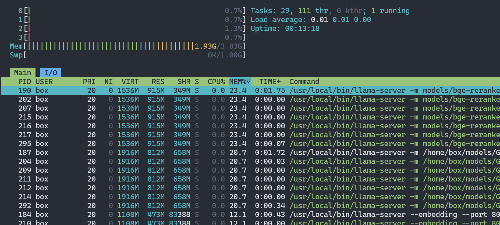
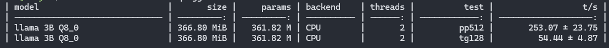

# Llamabox 

[](https://github.com/rajatasusual/llamabox/actions/workflows/check.yml)  
  

> **Run a full local RAG pipeline on your low-end, CPU-only Windows machine. Private, resilient, secure.**  
> **TL;DR:** See [SUMMARY.md](docs/SUMMARY.md) for the stack breakdown and performance.

---

## 🚀 What Is Llamabox?

**Llamabox** lets you self-host a complete AI and database stack inside **WSL2 + Debian**, optimized for **CPU-only, low-resource machines**. It's built for privacy-first applications like chatbots, AI search, and offline assistants—**no GPU, no OpenAI keys, no cloud APIs**.

🧠 Llamabox includes:
- **llama.cpp**: CPU-only inference engine  
- **Redis Stack**: Vector database for embeddings  
- **Neo4j**: Graph-based knowledge base  
- **Secure systemd-based setup**: Auto-restarting services  
- **Optional browser extension**: Capture and sync content from Chrome/Edge



---

## 📑 Table of Contents

1. [Overview](#-what-is-llamabox)
2. [Why WSL2 + Debian?](#-why-wsl2--debian)
3. [Use Cases](#-use-cases)
4. [Key Features](#-features)
5. [Prerequisites](#-prerequisites)
6. [Installation](#-installation)
7. [Service Management](#-service-management)
8. [Performance Benchmarks](#-performance-benchmarks)
9. [FAQ & Troubleshooting](#-faq--troubleshooting)
10. [Contributing](#-contributing)
11. [License & Credits](#-license--credits)
12. [Browser Extension](#-browser-extension)

---

## 🐧 Why WSL2 + Debian?

- ✅ **WSL2** runs native Linux with low overhead on Windows  
- ✅ **Debian** is lightweight and rock-stable  
- ✅ **No Docker needed** – systemd and all services run directly under WSL  
- ✅ Keeps everything local and private, with no cloud dependencies

---

## 🛠️ Use Cases

- 💬 Local chatbots and AI assistants  
- 🔍 Search over documents, pages, and structured data  
- 🧩 Graph-based reasoning with Neo4j  
- 🧠 Embed and store knowledge using Redis vectors  
- 🛡️ Fully offline / air-gapped deployments

---

## 🧩 Features

### 🛡️ Security
- Passwordless local use; optional `fail2ban`, `ufw` for edge exposure
- No SSH exposed by default
- Auto security updates with `unattended-upgrades`

### 🔄 Resilience
- All critical services are systemd-managed
- Auto-restarts on crash or reboot
- Logs available via `journalctl`

### 🧠 RAG Pipeline
> CPU-only, cloud-free, privacy-first Retrieval-Augmented Generation:
1. User sends query → `llama.cpp`  
2. Query embedding → Redis vector DB  
3. Knowledge retrieved → Neo4j  
4. Final answer generated → All local

### ⚙️ Light on Resources
- ~1GB idle memory usage
- Runs on as little as 2 cores and 4GB RAM
- Zero GPU required

---

## 🖥️ Prerequisites

- Windows 10/11 with WSL2
- Installed Debian distro via Microsoft Store or `wsl --install -d Debian`
- Min. 4GB RAM (8GB recommended)
- 20GB free disk space

---

## 📦 Installation

```bash
# In Windows Terminal:
wsl --install -d Debian

# Inside Debian WSL shell:
sudo apt update && sudo apt install git -y
git clone https://github.com/rajatasusual/llamabox
cd llamabox
./setup.sh
```

🔧 See [INSTALLATION.md](docs/INSTALLATION.md) for customization and optional steps.

---

## 🔃 Service Management

```bash
# Check service statuses (Redis, Neo4j, llama-server, etc.)
./scripts/check.sh

# Or manually start a specific service:
sudo systemctl restart neo4j
sudo journalctl -u llama-server.service
```

📘 More in [MANAGE.md](docs/MANAGE.md)

---

## 🚀 Performance Benchmarks

> Test device: 4-core AMD Z1, 4GB RAM, WSL2 Debian  
> Model: **LLaMA 3B Q8_0**

| Threads | Prompt Type | Tokens/sec | Notes |
|---------|-------------|------------|-------|
| 2       | `pp512`     | 253.07 ± 23.75 | Long-form |
| 2       | `tg128`     | 54.44 ± 4.87   | Short query |



✅ Runs smoothly on CPU-only setup  
✅ Great for background tasks and lightweight chatbots  
✅ All on a 10-year-old laptop? Yes.

---

## ❗️ FAQ & Troubleshooting

- ❓ **Systemd isn't working in WSL2**  
  ✅ Add this to `/etc/wsl.conf`:
  ```ini
  [boot]
  systemd=true
  ```

- ❓ **"Out of memory" loading model**  
  ✅ Try a smaller GGUF model  
  ✅ Or edit `.wslconfig` on Windows:
  ```ini
  [wsl2]
  memory=8GB
  ```

- ❓ **Redis or Neo4j not starting?**  
  ✅ Run `./scripts/check.sh`  
  ✅ Or restart manually: `sudo systemctl restart redis-stack-server`

More in [FAQs.md](docs/FAQs.md)

---

## 🤝 Contributing

We’d love your help!  
- Create issues, fix bugs, suggest features  
- PRs welcome: fork → feature branch → pull request  
- Style guide and guidelines coming soon

---

## 📄 License & Credits

Licensed under the **MIT License**.  
Shout-outs:
- [llama.cpp](https://github.com/ggml-org/llama.cpp)
- [Redis Stack](https://redis.io/)
- [Neo4j](https://neo4j.com/)
- [WSL2](https://learn.microsoft.com/en-us/windows/wsl/) ❤️

---

## 🌐 Browser Extension

The [Llamabox Extension](https://github.com/rajatasusual/llamabox_extension) captures web pages and sends them to your local server for embedding.

🔹 Features:
- Extract full article text or selection
- Sync with WSL2 HTTP server
- Works offline, configurable shortcuts

🔧 To install:
- Clone the repo
- Load `extension/` as an unpacked extension in Chrome or Edge
- Set WSL IP in config page

Docs: [llamabox_extension/README.md](https://github.com/rajatasusual/llamabox_extension/blob/master/README.md)
